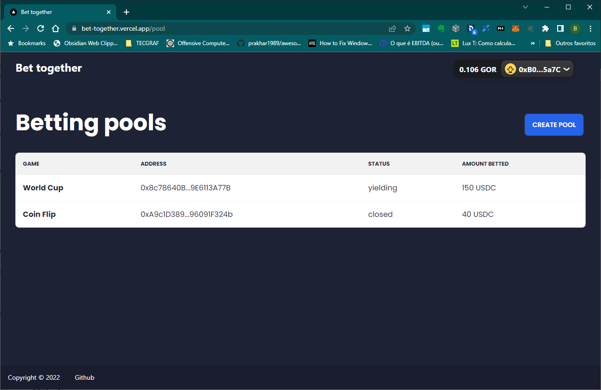
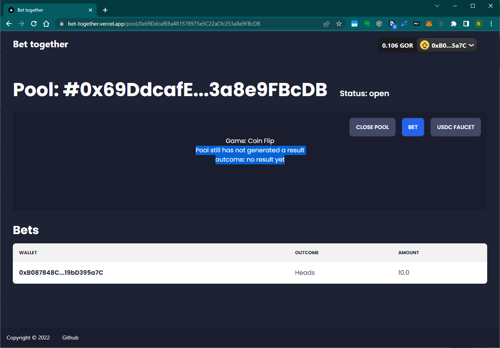

# Bet together
Bet together is a no-loss crypto betting protocol that allows you to gamble on different on chain and off chain events without losing a dime.

# Pitch
The protocol is inspired by the pooltogether's no-loss-lottery. The main idea is to pool the funds that the users bet and generate yield with it. After the betting event result is known, we distribute the yield to the winning side and the losing side still keeps its principal. We believe the main use case for the protocol would be betting on sports championships that span an extended period, like football leagues.

# MVP for the hackathon

For the betting side, our MVP implements a simple coin flip and a simulated world cup pool using chainlink's VRF for the random number generation. For the yield part, we built our yield source on top of AAVE V3.

- Video: [link](https://www.youtube.com/watch?v=do5MtpuHCZM)
- Slides: [link](https://docs.google.com/presentation/d/1mNRR-ulZWYaKc9-WqByxrcpb3BvaAlYNmjsQOidGKwg/edit#slide=id.p)

# How it works
### Contracts operation:
- Pool is created: owner defines a game contract and a yield source
- Open for bets: User's can place bets on the game's options
- Pool is locked: when the pool is locked the funds are automatically deposited on the yield source.
- Result generated: after the result is known, the users can withdraw their funds

### Frontend:
Main page: users can create a new pool or select an existing one.

Pool page: users can place bets. If the user is the pool owner, he can close the pool, and generate the result.

### Smart contracts:
- Core
  - **BettingPoolFactory**: Deploys new bettingPools contracts
  - **BettingPool**: Manages users’ funds, bets and yield distribution
  - **IResultController** Interface: controls bets options and result generation
  - **IYieldSource** interface: controls the yield generation
- Instance contracts:
  - **baseResultController**: base implementation o a result controller.
  - **vrf**
    - **baseVRFController**: base implementation of the vrf result controllers
    - **VRFCoinFlip**: simple vrf coin flip.
    - **VRFWorldCup**: world cup simulated vrf pool.
    - **VRFResultFactory**: it is responsible for deploying new coinflip and worldcup controllers and manages the vrf random numbers requests.
  - **Custom Pool factory**
    - **aaveVrfBettingPoolFactory**: deploys the vrf result controllers and the aave yield source and creates a pool calling the **BettingPoolFactory**
- **Test**: testing purpose contracts

### Tecnologies used

- [create-web3](https://www.create-web3.xyz/)
- [Next.js](https://nextjs.org/)
- [Wagmi.sh](https://wagmi.sh/)

# Future work:
- Real-life events with chainlink oracles
- Sponsors: allow users to deposit funds to boost a pool's yield without betting. After the result is generated, the sponsor can withdraw its whole principal.
- Private pools: pool's owner can restrict who can bet.
- No locking period: free withdraws, like pooltogether.
